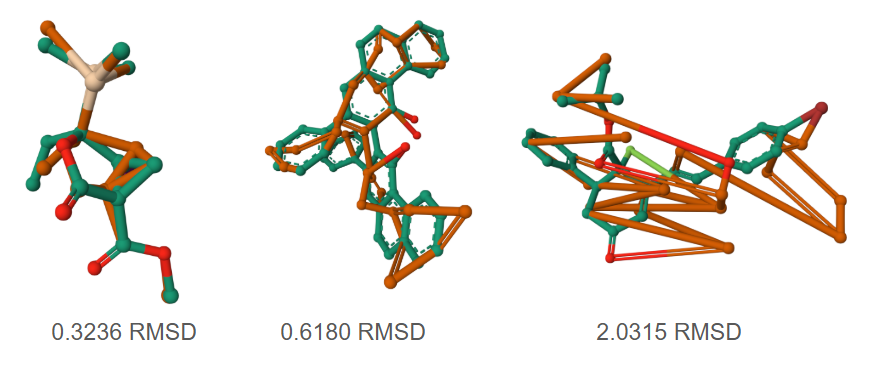
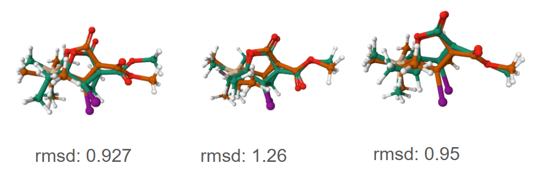
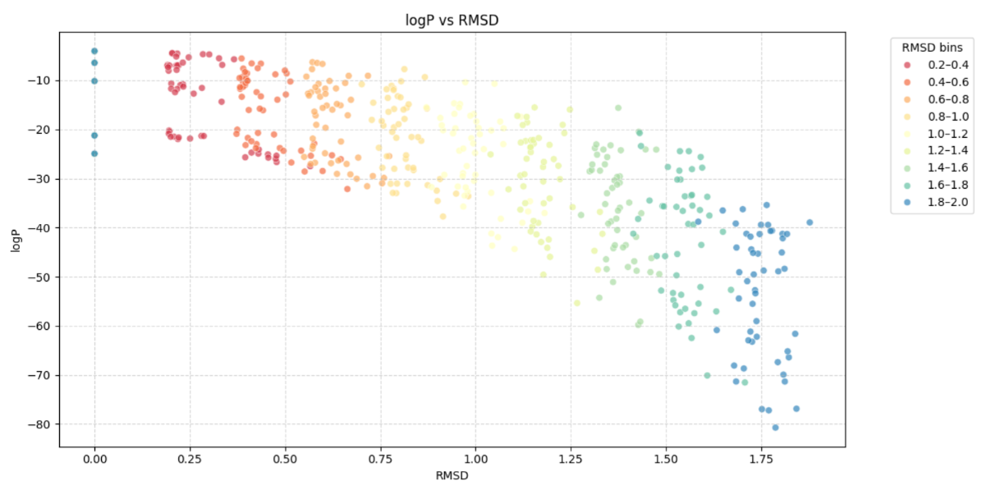
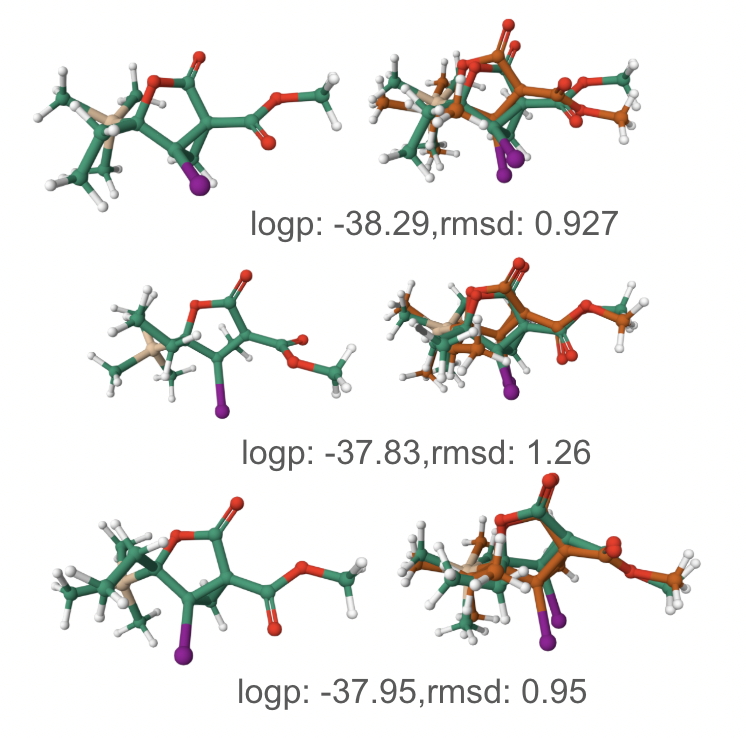

# Stable Conformation Probability Analysis (Course Project)

This repository contains code and experiments for **Stable Conformation Probability Analysis**, a course project in machine learning for drug design. The project investigates how effectively a flow-based generative model can evaluate and predict the stability of molecular conformations.

We build on the [Continuous Graph Conformation Flow (CGCF)](https://github.com/MinkaiXu/CGCF-ConfGen) model by Xu *et al.* (ICLR 2021), using a pre-trained CGCF (trained on the [GEOM](https://github.com/learningmatter-mit/geom) dataset of molecular conformations) as a normalizing flow to assign probabilities (log-likelihoods) to different 3D conformations of molecules.

To evaluate the model's ability to recognize stable structures, we simulate suboptimal conformers through controlled perturbations of atom positions and molecular orientations. As a primary metric of deviation, we use **Root-Mean-Square Deviation (RMSD)** to quantify how far a perturbed conformation strays from a known stable reference structure.

## Methodology and Hypotheses

### Data Perturbation Methodology

In the absence of "bad" conformations in the provided data (the CIF crystal structures), we generate **synthetic suboptimal conformations** to challenge the model. Starting from a known correct (low-energy) conformation of each molecule, we introduce controlled random perturbations:

- **Atomic positional noise**: Small random displacements are added to the coordinates of each atom. This simulates slight deviations in bond lengths and angles.
- **Orientation perturbation**: The entire molecule is randomly rotated and translated before evaluation. *(While RMSD calculations typically align structures to cancel out overall rotations/translations, we still randomize orientation to ensure the model’s evaluation is orientation-invariant and to diversify initial states for force-field optimization.)*



- **Generating more realistic conformations**:  
  For generating more realistic conformations, we use:
  `rdkit.Chem.rdDistGeom.EmbedMultipleConfs`,  
  which employs Experimental-Torsion Knowledge Distance Geometry (ETKDG). This method incorporates torsion angle preferences derived from the Cambridge Structural Database (CSD), resulting in physically plausible 3D geometries.



We generate a range of perturbed conformers per molecule, from near-native (very small RMSD) to heavily distorted (large RMSD). **RMSD (Root Mean Square Deviation)** is computed after aligning each perturbed conformation to the reference structure and serves as a quantitative measure of distortion — higher RMSD indicates a more significant departure from the stable conformation.


Using these perturbed conformers, their CGCF log-probabilities, and classical optimization results, we explore the following research hypotheses:

---

### Hypothesis 1: Local Minima Detection for OOD Conformations

A flow-based model can recognize and effectively locate local energy minima even for **out-of-distribution (OOD)** conformations.

Even if a conformation is far from anything seen in training (e.g., a highly distorted structure), the model’s probability evaluation should guide us toward a nearby stable state. We expect that conformers closer to true low-energy structures (smaller RMSD) will receive higher log-probability scores, indicating the model’s ability to detect when a molecule is in a basin of attraction around a local minimum.

We evaluate this both on randomly noised conformations and on realistic conformations generated using RDKit’s ETKDG method.




---

### Hypothesis 2: Energy–Log Probability Correlation

There is a meaningful correlation between a molecule’s physically optimized energy and the CGCF model’s **log-probability** for that conformation.

Since CGCF was trained on ensembles of low-energy conformers, we hypothesize that its learned probability distribution reflects true molecular stability. We test this by plotting conformational energies (e.g., from MMFF or DFT) against the model-computed log-probabilities.

A Spearman inverse correlation would support the idea that the flow’s probability landscape approximates the true energy surface — i.e., lower-energy conformers should have higher probabilities.

Our analysis shows trends indicating this relationship, although not perfectly — likely due to the model being trained on likelihood, not energy, directly.
Few examples:

| SMILES | Spearman | Pearson |
|--------|----------|---------|
| `CO[C@H]1CC[C@H]1O[CH][NH]` | -0.6321 (p = 0.0115) | -0.7790 (p = 0.0006) |
| `O=C1CC(=O)[C@@H](O)CO1` | -0.1905 (p = 0.6514) | -0.2597 (p = 0.5346) |
| `C[C@@H](O)C#C[C@H]1C[C@H]1C` | -0.4939 (p = 0.0014) | -0.3203 (p = 0.0468) |


## Repository Structure

The repository is organized into the following main components:

- **`model/`** – Contains the code for the CGCF normalizing flow model, adapted for this project. This includes utilities needed to load the pretrained model and evaluate log-probabilities of conformations.

- **`datasets/`** - Code and data utilities for handling molecular conformations used in our
experiments. This may include scripts to generate or load molecular structures and their
conformers.

- **`random_noice_anaysis.ipynb`** - Jupyter notebook containing analysis and visualisation of **hypothesis 1** veryfing the local optima in random noice. 

- **`correlation_analysis.ipynb`** – Jupyter Notebook containing the statistical analysis and
visualizations for **hypothesis 2** .

## Setup and Usage

To reproduce the experiments and use the code in this repository, follow these steps:

### 1. Clone the Repository

```bash
git clone https://github.com/xFloly/stable_conformation.git
cd stable_conformation
```

### 2. Create the Conda Environment

The main functionality resides within a modified subtree module:

```sh
cd model/CGCF/
```

Create and activate the environment using:

```bash

conda env create -f env.yml
conda activate CGCF
```

### 3. Install PyTorch Geometric

Due to dependency constraints, PyTorch Geometric and its companion packages must be installed manually:

```bash
pip install torch-scatter==2.0.5 \
            torch-sparse==0.6.8 \
            torch-spline-conv==1.2.0 \
            -f https://data.pyg.org/whl/torch-1.6.0+cu101.html

pip install torch-geometric==1.7.2
```

Make sure these versions match your PyTorch (`1.6.0`) and CUDA (`10.1`) configuration.


### 4. Calculate Log-Probability

To run predictions, you first need to prepare the dataset. For our purposes, we used the dataset linked below and placed it in the `/data/` directory.

To start the prediction process, run the following command in the terminal:

```sh
python analyse_from_sdf_all.py
```

If you are using a different dataset, make sure to adjust the file _`analyse_from_sdf_all.py`_ accordingly.

---

## Data

For our course experiments and data analysis, we used the dataset available [here](https://ujchmura-my.sharepoint.com/:f:/g/personal/filip_soszynski_student_uj_edu_pl/EsX49nFKA8ZFuLXY6vcO6KwBptFEkI_EUPOb_ILuRzbvwQ?e=psc7ap).

